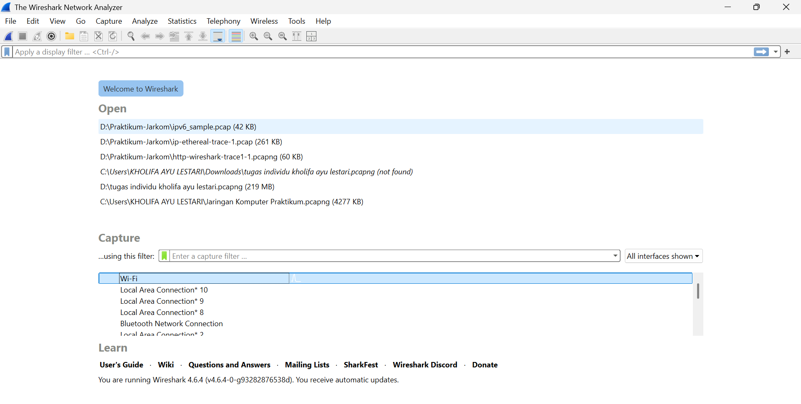
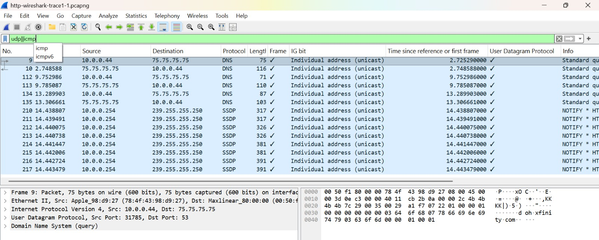
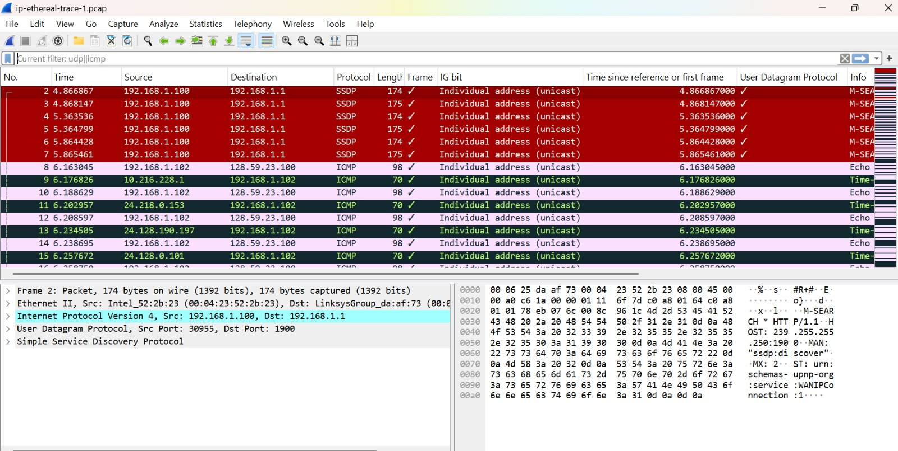

# laporan praktikum modul 10 dan 11

# tujuan praktikum
1. dapat menginvestigasi cara kerja protokol IP menggunakan Wireshark
2. dapat menginvestigasi cara kerja protokol DHCP menggunakan Wireshark.

# langkah praktikum mod 10
1. pertama buka wireshark terlebih dahulu, lalu klik open file di pojok atas kiri, lalu cari file yang di suruh oleh modul penugasan.

2. setelah filenya di buka, lalu pada filter klik 'udp||icmp' 

3. setelah berhasil, lalu buka lagi file open baru yang di suruh oleh modulnya. 

4. 

