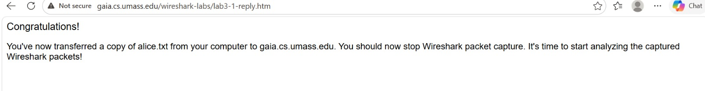
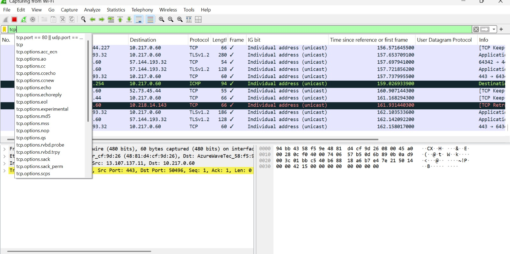
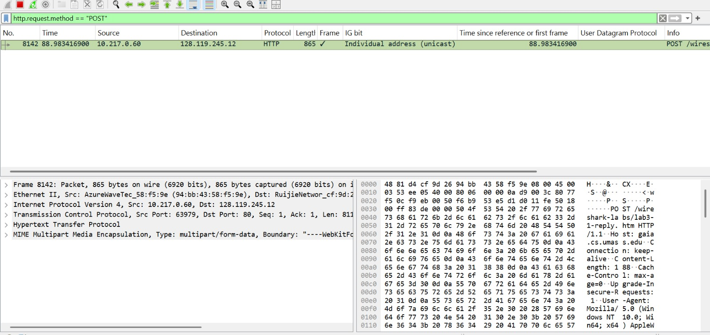
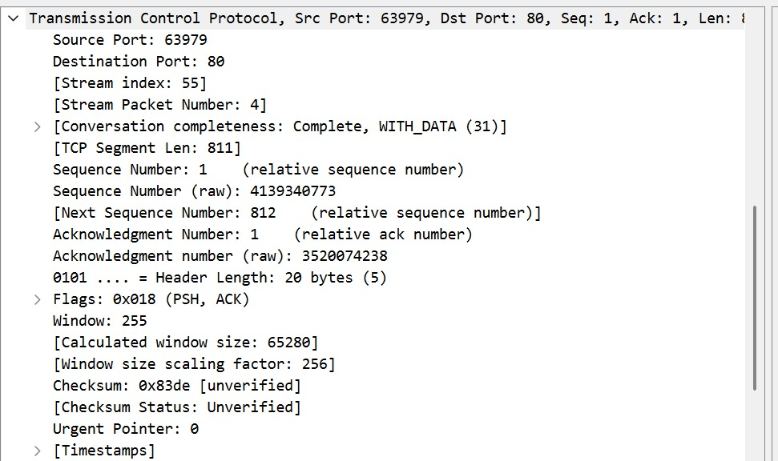

# Laporan praktikum modul 6

# Tujuan praktikum
1. dapat menginvestigasi cara kerja protokol TCP menggunakan Wireshark

# Langkah Praktikum 
1.jalankan browser, Buka http://gaia.cs.umass.edu/wireshark-labs/alice.txt dan
unduh salinan ASCII dari naskah Alice in Wonderland. Simpan file tersebut di laptop. lalu muncul tampilan gambar dibawah:
 

2. Gunakan tombol Browse untuk memasukkan nama file (nama path lengkap) dari file Alice
in Wonderland yang terletak di modul. Jangan dulu menekan tombol “Upload
alice.txt file”
· Sekarang, jalankan Wireshark dan mulai penangkapan paket.
· Kembali ke browser, tekan tombol “Upload file alice.txt” untuk mengunggah file ke
server gaia.cs.umass.edu. Setelah file diunggah, pesan berisi ucapan selamat akan
ditampilkan di browser.

3. Hentikan penangkapan paket pada Wireshark. Jendela Wireshark akan terlihat. klik pada filter lalu ketik "TCP"
seperti gambar di bawah.

4. selesai

# Jawab Pertanyaan:
1. Berapa alamat IP dan nomor port TCP yang digunakan oleh komputer klien (sumber) untuk
mentransfer file ke gaia.cs.umass.edu? Cara paling mudah menjawab pertanyaan ini adalah
dengan memilih sebuah pesan HTTP dan meneliti detail paket TCP yang digunakan untuk
membawa pesan HTTP tersebut. (128.119.245.12)

2.  Berapa nomor urut segmen TCP yang berisi perintah HTTP POST? Perhatikan bahwa untuk
menemukan perintah POST, Anda harus menelusuri content field milik paket di bagian
bawah jendela Wireshark, kemudian cari segmen yang berisi "POST" di bagian field DATAnya. (Segment TCP yang berisi HTTP POST memiliki Sequence Number = 1.
Segmen ini ditandai dengan flag PSH, ACK dan memiliki panjang data sebesar 811 byte.)

3. Berapa panjang setiap enam segmen TCP pertama? (Panjang segmen pertama adalah 811 byte.)

4. Berapa jumlah minimum ruang buffer tersedia yang disarankan kepada penerima dan
diterima untuk seluruh trace? Apakah kurangnya ruang buffer penerima pernah
menghambat pengiriman? ( Window size (calculated) = 65280
Nilai minimum buffer penerima yang terdeteksi adalah 65280 byte.
Tidak terdapat indikasi bahwa kekurangan buffer menghambat pengiriman data.)

5. Berapa banyak data yang biasanya diakui oleh penerima dalam ACK? Dapatkah anda
mengidentifikasi kasus-kasus di mana penerima melakukan ACK untuk setiap segmen yang
diterima? ( Penerima biasanya mengakui data secara kumulatif, bukan per segmen.
Dalam trace ini, ACK mengakui sejumlah byte tertentu (misalnya ~800–1500 byte), tergantung ukuran segmen yang diterima.)
