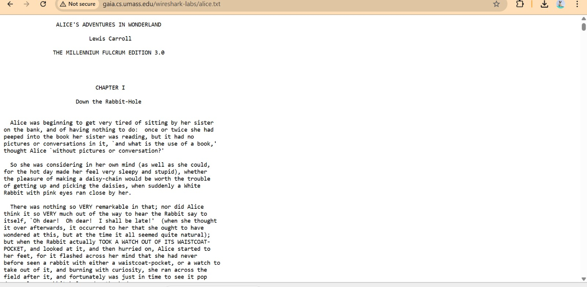
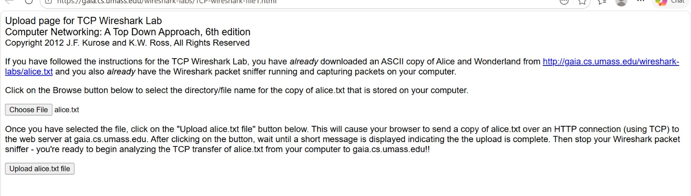

# Laporan praktikum modul 6

# Tujuan praktikum
1. dapat menginvestigasi cara kerja protokol TCP menggunakan Wireshark

# Langkah Praktikum 
1.jalankan browser, Buka http://gaia.cs.umass.edu/wireshark-labs/alice.txt dan
unduh salinan ASCII dari naskah Alice in Wonderland. Simpan file tersebut di laptop. lalu muncul tampilan gambar dibawah:
 

2. 