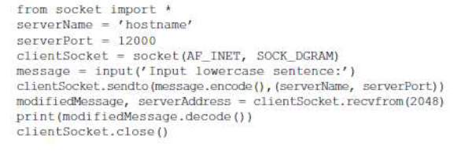
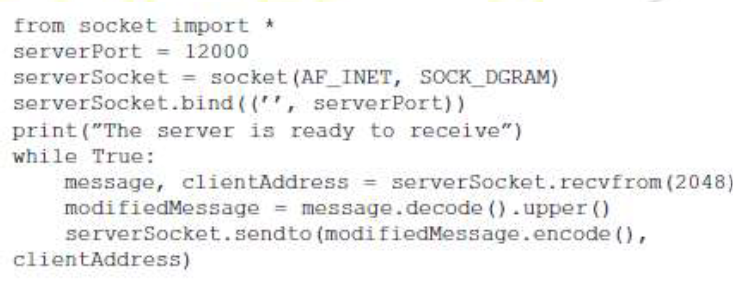

# laporan praktikum modul 7 
# modul 7: socket programming
# tujuan praktikum:
1. bisa membuat program berbasis socket UDP
2. bisa membuat program berbasis socket TCP

# langkah praktikum modul 7
1. buat file UDPClient.py:

2. lihat baris kode di UDPClient.py yang bagian from socket import*
modul soket membentuk dasar dari semua komunikasi jaringan dengan Python. Dengan
memasukkan baris ini, kita akan dapat membuat soket dalam program kita.
serverName = ‘hostname’
serverPort = 12000
Baris pertama menetapkan variabel serverName ke string 'hostname'. Di sini, kita menyediakan
string yang berisi alamat IP server (contohnya “128.138.32.126”) atau nama host server (contohnya
“cis.poly.edu”). Jika kita menggunakan nama host, maka pencarian DNS akan secara otomatis
dilakukan untuk mendapatkan alamat IP. Baris kedua mengatur serverPort variabel integer ke
12000.
clientSocket = socket(AF_INET, SOCK_DGRAM)
Baris ini membuat soket klien, yang disebut clientSocket. Parameter pertama menunjukkan
keluarga alamat; khususnya, AF_INET menunjukkan bahwa jaringan yang mendasarinya
menggunakan IPv4. Parameter kedua menunjukkan bahwa soket bertipe SOCK_DGRAM, yang
berarti soket tersebut adalah soket UDP (bukan soket TCP).
Perhatikan bahwa kita tidak menentukan nomor port soket klien saat kita membuatnya; kita malah
membiarkan sistem operasi melakukan ini untuk kita. Sekarang pintu proses klien telah dibuat, kami
ingin membuat pesan untuk dikirim melalui pintu.
message = input(’Input lowercase sentence:’)
input() adalah fungsi bawaan dalam Python. Ketika perintah ini dijalankan, pengguna di klien
diminta dengan kata-kata "Masukkan kalimat huruf kecil:" Pengguna kemudian menggunakan
keyboardnya untuk memasukkan inputan yang dimasukkan ke dalam variabel message. Sekarang
kita memiliki soket dan pesan, kita ingin mengirim pesan melalui soket ke host tujuan.
clientSocket.sendto(message.encode(),(serverName,serverPort))
Pada baris di atas, pertama-tama kita mengubah pesan dari tipe string ke tipe byte, karena kita
perlu mengirim byte ke dalam soket; ini dilakukan dengan metod encode(). Metod sendto()
melampirkan alamat tujuan (serverName,serverPort) ke pesan dan mengirimkan paket yang
dihasilkan ke soket proses, clientSocket. Setelah mengirim paket, klien menunggu untuk menerima
data dari server.
modifiedMessage, serverAddress = clientSocket.recvfrom(2048)
Dengan baris di atas, ketika sebuah paket tiba dari Internet di soket klien, data paket tersebut
dimasukkan ke dalam variabel modifiedMessage dan alamat sumber paket tersebut dimasukkan ke
dalam variabel serverAddress.

3. lalu buat lagi file UDPServer.py

4. lalu hubungkan ke client dengan menggunakan 2 laptop
