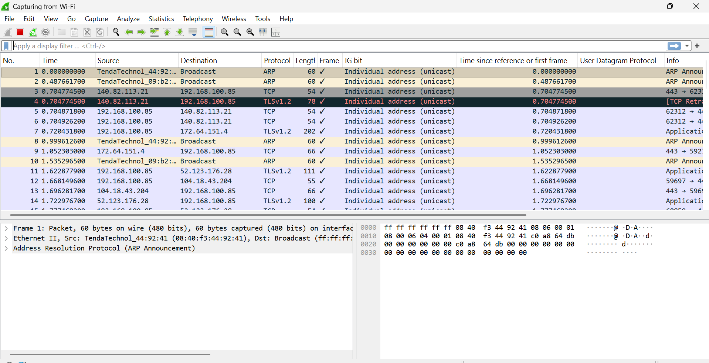

# laporan praktikum modul 12 & 13 :

# tujuan praktikum modul 12
1. dapat menginvestigasi cara kerja protokol DHCP menggunakan wireshark

# langkah praktikum
1. buka wireshark dan mulai capture pada adapter yang digunakan wifi.
2. buka command propt sebagai administrator.
3. lepaskan alamat IP.

4. minta alamat IP baru dari DHCP 

5. kembali ke wireshark dan hentikan capture
6. gunakan filter dhcp 

7. selesai

# langkah praktikum modul 13 Ethernet dan ARP
1. pastikan cache browser Anda kosong. Untuk melakukan hal ini pada Mozilla
Firefox V3, pilih Tools -> Clear Recent History dan centang kotak untuk Cache. Untuk
Internet Explorer, pilih Tools -> Internet Options -> Delete Files. Mulai sniffer paket
Wireshark.

2. Masukkan URL berikut ke dalam browser Anda
http://gaia.cs.umass.edu/wireshark-labs/HTTP-ethereal-lab-file3.html

3. hentikan penangkapan paket wireshark.

4. selesai
