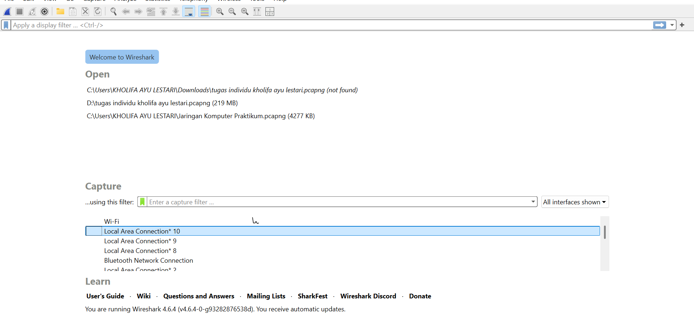
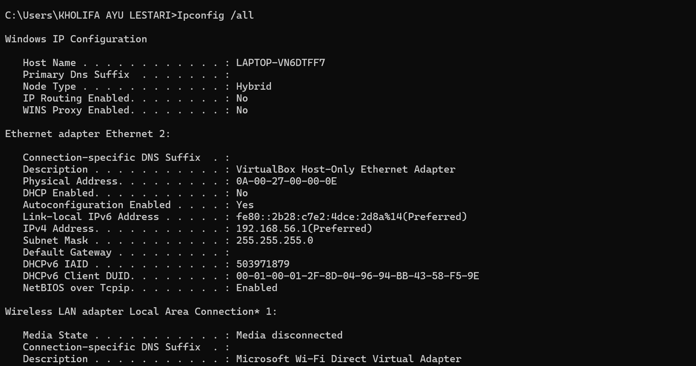

# Laporan Modul 4 Praktikum Jarkom

# Tujua Praktikum
1. dapat menginvestigasi cara kerja DNS menggunakan wireshark

# Langkah Praktikum
1. buka command promp, lalu ketik nslookup

2. lalu coba lagi ketik Ipconfig di command prompt

