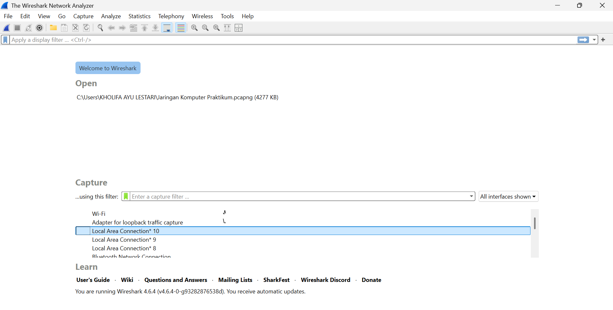

#laporan Praktikum Jarkom If-04-01

#tujuan Praktiku
dapat melakukan wireshark dan mempelajari wireshark

#langkah-langkah Instalasi
1. unduh wirehark pada modul 
2. klik donwload, pilih versi windows
3. jalankan file installer
4. klik next sampai tahap komponen
5. pastikan Npcsp dicentang
6. klik instal
7. tunggu sampai selesai, lalu klik finish
8. wireshark siap dipakai

##lampiran
hasil gambar:

