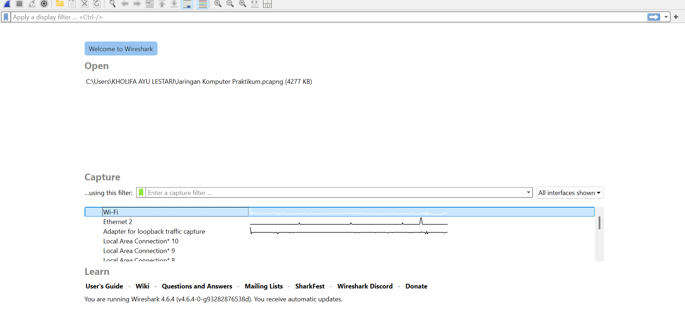
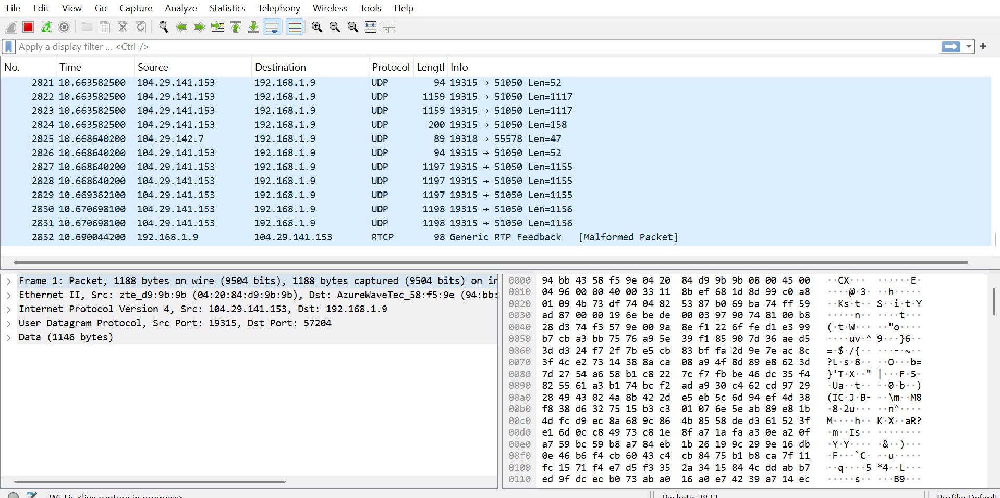
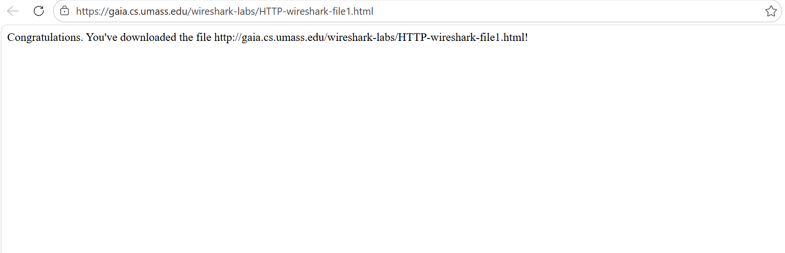
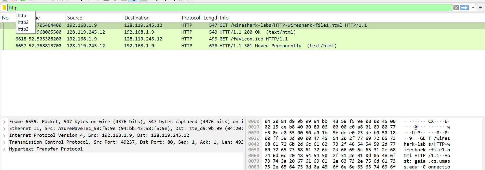

# laporan praktikum 3 HTTP

# tujuan Praktikum
dapat menginvestigasi cara kerja protokol HTTP menggunakan wireshark.

# langkah Percobaan
hasil percobaan:
1. buka wireshark terlebih dahulu

2. klik wifi, lalu dijalankan 

3. buka browser web dan ketik HTTP pada filter di wireshark

